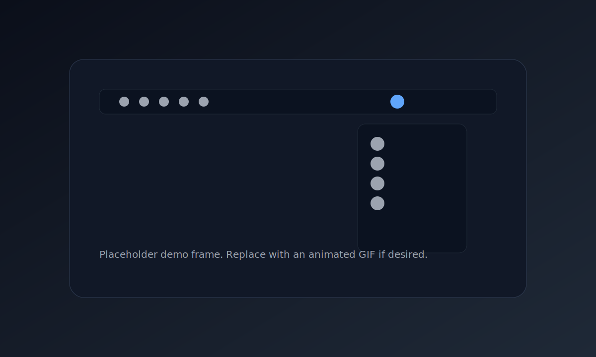

# ZenBar


Restore peace to your macOS menu bar.

ZenBar lets you declutter by dragging status icons onto the ZenBar anchor. Click ZenBar to reveal hidden apps in a clean, floating list. Minimalist, native, and distraction-free.

## Demo



> Replace `assets/zenbar-demo.svg` with a real animated GIF when you have one. The README will render it automatically.

## Features

- Drag a menu bar icon onto ZenBar to hide it
- Click ZenBar to toggle a floating list of hidden icons
- Icons-only list with tooltips
- Per-app persistence across restarts
- Manual reorder via drag within the list
- Safe fallback when private controls are unavailable

## Requirements

- macOS 14+
- Accessibility permission (for menu bar discovery and control)

## Build and Run (SwiftPM)

```bash
swift build
swift run ZenBar
```

## Usage

1. Launch ZenBar (menubar icon appears).
2. Hold **Command** and drag a menu bar icon onto ZenBar.
3. Click ZenBar to show the hidden icons list.
4. Click an icon in the list to open its original menu.
5. Right‑click ZenBar for status and quit.

## Permissions

ZenBar needs Accessibility permission to detect and control menu bar items.
If permission is denied, ZenBar runs in a limited mode.

## Packaging

```bash
./scripts/package.sh 0.1.0
```

The DMG will be created under `dist/`.

## Release (GitHub Actions)

- Tag a release: `git tag v0.1.0 && git push origin v0.1.0`
- The workflow builds a DMG, creates a GitHub release, and updates the Homebrew cask if `HOMEBREW_TAP_TOKEN` is set.

## Homebrew

```bash
brew tap younggglcy/tap
brew install --cask zenbar
```

## Limitations

- Uses Accessibility APIs and private attributes (e.g., `AXHidden`, `AXPosition`) when available.
- If private controls are not writable, ZenBar falls back to read/press behavior and does not physically hide icons.

## Development Notes

This project is a Swift Package. If you rely on Xcode tooling that needs a `.xcodeproj`/`.xcworkspace`, open `Package.swift` directly in Xcode or use SwiftPM commands above.
